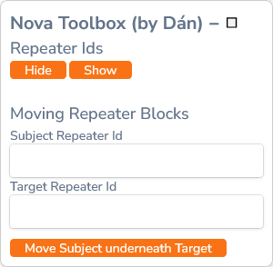

# Nova toolbox
Little tool which helps me in writing guides using Laravel Nova for [SnowCrows](https://www.snowcrows.com). Laravel Nova has one big issue I always ran into: there is no easy way to move repeater fields (the things we use for headers, grids, text, ...). This meant that anytime I wanted to add a new field to the top of a guide I had to manually click ~150 times. I hated it so I wrote this tool for it.

## What does it do?
It moves repeater fields for you, no more clicking 150 times for a single text field. All you have to do is provide the id of the repeater field you want to move and the id of a repeater field where you want to move it to. The toolbox will then do all the clicking for you.

## How do I install it?
> You'll have to do this every time you open the edit page of a guide.
1. Open the developer console in your browser
	- Firefox: Ctrl + Shift + K
	- Chrome: Ctrl + Shift + I
	- Edge: Ctrl + Shift + J
1. Copy the contents of the [NovaToolbox.js file](./NovaToolbox.js)
1. Paste it inside the developer console and press the enter key
	- Some browsers don't directly allow you to paste code into the developer console, if so follow the steps the browser tells you to follow and try pasting it again.
1. Voila, the toolbox should now appear in the bottom right hand corner of your browser.

## How to actually use it?
1. Click on the "Show" button of the toolbox. This will add a repeater id to every repeater field.
1. Retrieve the id of the repeater field you want to move and paste it into the "Subject Repeater Id" field of the toolbox.
1. Retrieve the id of the repeater field you want the previous step's repeater field to move to and paste it into the "Target Repeater Id" field of the toolbox.
1. Click on the "Move Subject underneath Target". The toolbox will now move the subject repeater field underneath the target repeater field.

## Will this work forever?
I don't know, but as long as I'm actively using it I'll keep it updated.